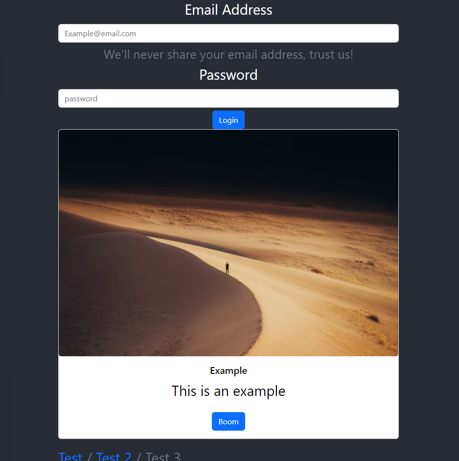

# Getting Started with Create React App

## Table of contents

- [Overview](#overview)
  - [The challenge](#the-challenge)
  - [Screenshot](#screenshot)
  - [Links](#links)
- [My process](#my-process)
  - [Built with](#built-with)
  - [What I learned](#what-i-learned)
  - [Continued development](#continued-development)
  - [Useful resources](#useful-resources)

## Overview
React Bootstrap Demo Tutorial

### The challenge

Users should be able to:

- Learn how to install create-react-app
- Learn how to use React and Bootstrap

### Screenshot

### Links

- Solution URL: https://github.com/Jud1th1/react-bootstrap-tutorial

## My process
-   Prior to starting this tutorial, I watched a few refresher videos about the command line and then installed npm to the terminal
-   Following along with the video, I worked locally through my terminal and to create the React app and then open the folder created into VSCode
-   I installed react and bootstrap through the VSCode terminal before continuing the video to learn how to add some of the components
-   We began by adding a button from react-bootstrap into our JavaScript code and then importing Bootstrap CSS to style the button
-   We deleted the surrounding excess code and then continued to import components such as a form with email and password fields, a card with an image and a button, a breadcrumb, an alert, and rows with columns.
-   Each element was styled using the Bootstrap CSS we imported
-	Add that was how I created a simple web page with some Bootstrap components. 

### Built with

- NPM Command Line
- Javascript
- React
- Bootstrap

### What I learned

-	I learned how use React to create a webpage
-   I learned how to use React with Bootstrap and code within js

### Continued development

I plan to practice more React projects 

### Useful resources

- //React Bootstrap Tutorial I followed https://www.youtube.com/watch?v=8pKjULHzs0s
- //Command Review https://www.youtube.com/watch?v=Jfvg3CS1X3A
- //npm review https://www.youtube.com/watch?v=P3aKRdUyr0s

